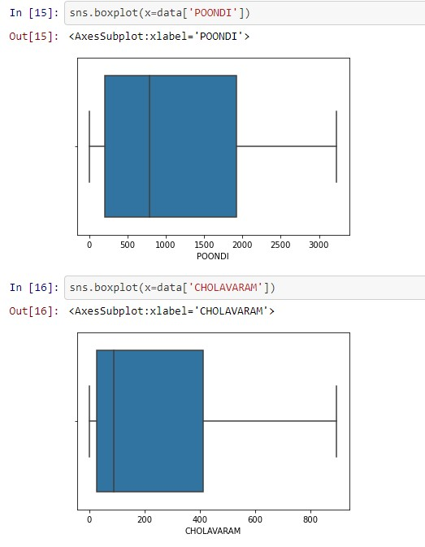
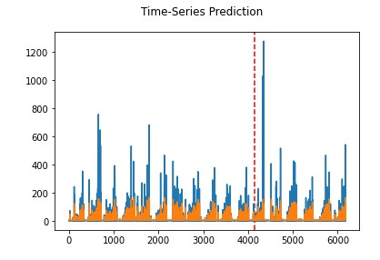
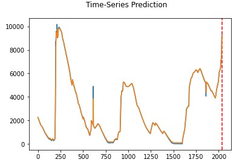

  <h2>Chennai Water Crisis</h2>
  

Chennai, also known as Madras is the capital of the Indian state of Tamil Nadu. Located on the Coromandel Coast off the Bay of Bengal, it is the biggest cultural, economic and educational centre of south India.
The city is facing an acute water shortage now (June 2019). Chennai is entirely dependent on ground water resources to meet its water needs. There are four reservoirs in the city, namely, Red Hills, Cholavaram, Poondi and Chembarambakkam, with a combined capacity of 11,057 mcft. These are the major sources of fresh water for the city.
Chennai has been facing acute water shortage due to it's lack of rainfall and mismanagment of water resources.
In this Repo, we will try to find out the reasons and why such mismanagments happended.

## Table of contents
* [Our Aim](#AIM)
* [Language Used](#Language)
* [Insights](#Insights)
* [LSTM-Model](#LSTM)
* [Data Visualization](#Data-Visualization)
* [Contact](#contact)

## AIM
We have divided this projects into three major parts
  * Insights with Visualizations
  * Creating Forecasting model 
  * Reasons of this water shortage

We want to solve this one by one and by using all the inshights, we can get from the above steps create a comprehensive conclusion on why chennai faced water shortage.

## Language
  The Language used for visualizations and forecasting was Python. For the the introductory visualizations, Zoho Analytics was used.

## Insights
### In this section, we will se some example of the Insight module

  

### These are some of the visualizations, used making Python and Matplotlib, for more [Click Here!](https://github.com/chiru30/DS-Hydro-project/blob/main/Insights/data%20insights-reservoir%20levels.ipynb)

## LSTM
Here this first image is the LSTM prediction graph, of the Chennai rain levels, Click for the [source code](https://github.com/chiru30/DS-Hydro-project/blob/main/LSTM_Rainfall_Level.ipynb)

  

Here this first image is the LSTM prediction graph, of the Chennai reservoir levels, Click for the [source code](https://github.com/chiru30/DS-Hydro-project/blob/main/LSTM_Reservoir.ipynb)

  

## Data-Visualization

Average reservoir level at Poondi over the years - Line chart  

Average reservoir level at Redhills over the years - Pie chart  

Average reservoir level at Cholavaram over the years - Bar chart  

Relative Bar chart for Cholavaram

## Status
Project is: _in progress_

## Contact
Created by [Chiranthana R R](https://www.linkedin.com/in/chiranthana-r-r-232385200/) - feel free to contact me!

Created by [Rohan Aditya Ram](https://www.linkedin.com/in/rohan-aditya-9b4816215/) - feel free to contact me!

Created by [Aditya Mukherjee](https://www.linkedin.com/in/aditya-mukherjee-817a17190/) - feel free to contact me!
